# Project Name

## 📌 Project Setup Instructions

1. **Clone the Repository:**
   ```sh
   git clone https://github.com/your-username/your-repo.git
   cd your-repo
   ```
2. **Install Dependencies:**
   ```sh
   npm install
   ```
3. **Run the Project:**
   ```sh
   npm start
   ```
4. **Build the Project:**
   ```sh
   npm run build
   ```
5. **Run on Emulator/Device (For Mobile Apps):**
   ```sh
   npx react-native run-android  # For Android
   npx react-native run-ios      # For iOS
   ```

---

## 🎯 Implemented Features

### ✅ Home Screen (Main Dashboard)
**Functionality:** Displays an overview of tasks, categorized into pending and completed sections.

**Key Elements:**
- ✅ **App Title:** "Smart To-Do List" (Top Header)
- ✅ **Quick Task View:**
  - 📌 **Pending Tasks:** Displays tasks that need to be completed.
  - ✅ **Completed Tasks:** Shows finished tasks.
- ✅ **Quick Actions:**
  - ➕ **Add Task Button** → Opens the task creation screen.
  - 📂 **View Tasks Button** → Navigates to the complete task list.

**Example UI Layout:**
- 📌 **Pending Tasks:**
  - 🛒 Buy Vegetables (Due Today)
  - 📄 Submit Report (Due Tomorrow)
- ✔ **Completed Tasks:**
  - 🧘 Morning Yoga (Yesterday)
  - 📞 Call Dad (2 Days Ago)
- [➕ Add New Task] [📂 View All Tasks]

---

### ✅ Add New Task Screen
**Functionality:** Allows users to create and add tasks with relevant details.

**Components:**
- 📝 **Task Title Input** (e.g., "Pay Electricity Bill")
- 🗓 **Due Date Selector** (Defaults to the current date)
- 📌 **Category Selection:** (Work, Personal, Fitness, Shopping, Miscellaneous)
- 📝 **Notes Section** (Optional)
- ✔ **Save Button** → Saves task to database
- ❌ **Cancel Button** → Returns to the previous screen

**Example UI Layout:**
- 📝 Task Title: [____________]
- 🗓 Due Date: [ Choose Date ]
- 📌 Category: [Shopping]
- 📝 Notes: [____________]
- [✔ Save Task] [❌ Cancel]

---

### ✅ Task List Screen
**Functionality:** Displays a structured list of all saved tasks with sorting and filtering options.

**Components:**
- 🔍 **Search Bar:** Filter tasks by keyword.
- 📌 **Sort & Filter Options:** Filter tasks based on date, category, or completion status.
- 📌 **Task Items Display:** Each item should show:
  - ✅ **Task Title**
  - 📆 **Due Date**
  - 📌 **Category**
  - ⏳ **Status (Pending / Completed)**
- ✏ **Tap to Edit:** Clicking a task should open the edit screen.
- 🗑 **Swipe to Delete:** Users can remove tasks by swiping left/right.

**Example UI Layout:**
- 🔍 Search: [_____________] [Filter]
- 📆 Date | 📌 Category | 📝 Task Title | ⏳ Status
- 📆 12 Sep 24 | 📖 Study | Read 5 Chapters | ⏳ Pending
- 📆 10 Sep 24 | 💼 Work | Send Emails | ✅ Completed
- 📆 08 Sep 24 | 🏃‍♂️ Health | Evening Walk | ✅ Completed

---

### ✅ Task Detail Screen
**Functionality:** Displays complete details of a selected task.

**Components:**
- 📝 **Task Title**
- 📆 **Due Date**
- 📌 **Category**
- ⏳ **Task Status (Pending/Completed)**
- 📝 **Task Notes**
- ✏ **Edit Button** → Modify task details
- 🗑 **Delete Button** → Remove task permanently

**Example UI Layout:**
- 📝 **Pay Electricity Bill**
- 📆 **Due Date:** 15 Sep 2024
- 📌 **Category:** Bills
- ⏳ **Status:** Pending
- 📝 **Notes:** Pay online before 5 PM.
- [✏ Edit Task] [🗑 Delete Task]

---

### ✅ Edit Task Screen
**Functionality:** Allows users to update task information.

**Components:**
- 📌 Same as Add Task Screen, but pre-filled with existing data.
- ✔ **Update Button** → Saves modifications.
- ❌ **Cancel Button** → Discards changes and returns to Task Detail Screen.

---

### ✅ Task Summary & Reports (Optional - Extra Credit Feature)
**Functionality:** Provides an analytical overview of tasks completed over time.

**Components:**
- 📊 **Graphical Report:** Bar Chart / Pie Chart representing task distribution.
- 📆 **Date Filter:** Users can select a time range (weekly/monthly).
- 📊 **Task Statistics:**
  - 📌 **Total Tasks:** 15
  - ⏳ **Pending Tasks:** 7
  - ✅ **Completed Tasks:** 8

---

## 🔥 Firebase & Firestore Integration
- This project uses **Firebase** for backend services and **Firestore**, a NoSQL cloud database, for storing task data.
- Firestore ensures seamless real-time data synchronization, allowing users to manage their tasks efficiently across multiple devices.
- All task-related data, including title, due date, category, status, and notes, are securely stored in the Firestore database.

---

## 📸 Screenshots of the App


;
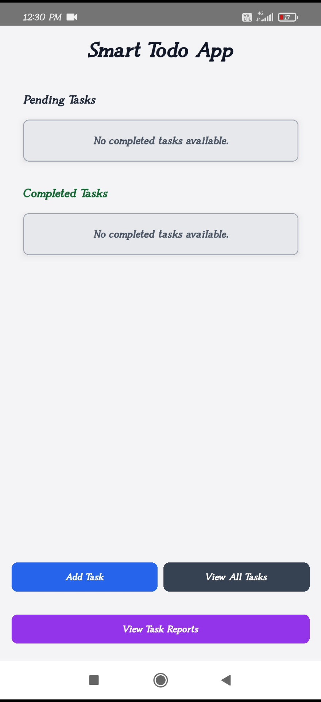;
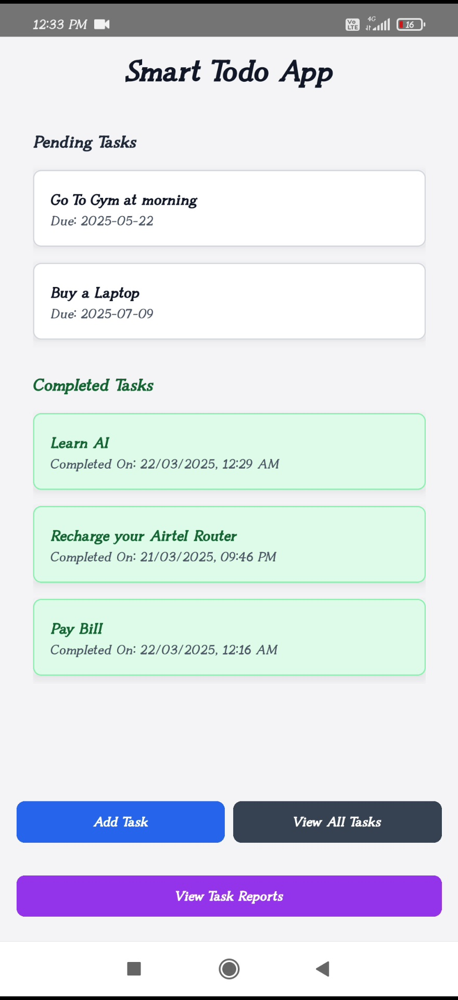;
;
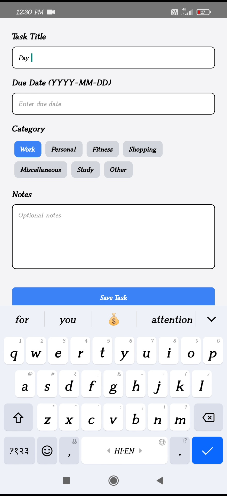;
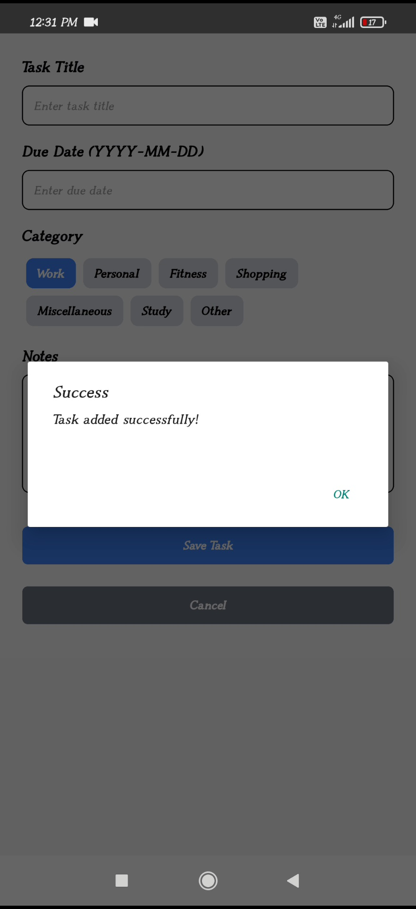;
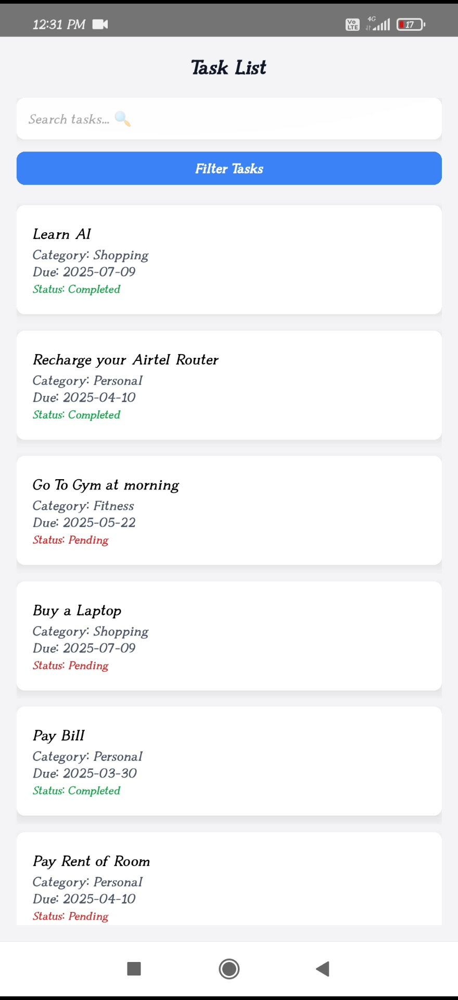;
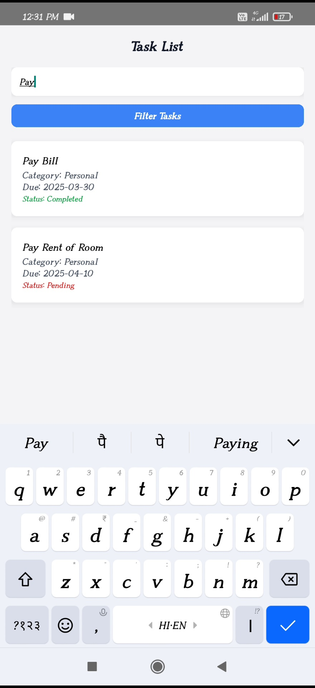;
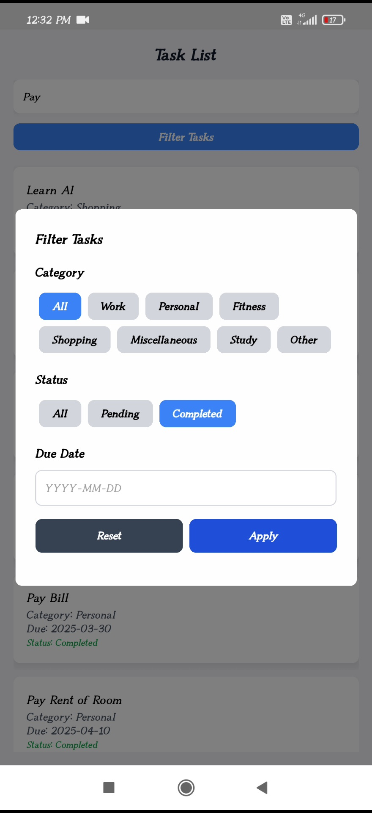;
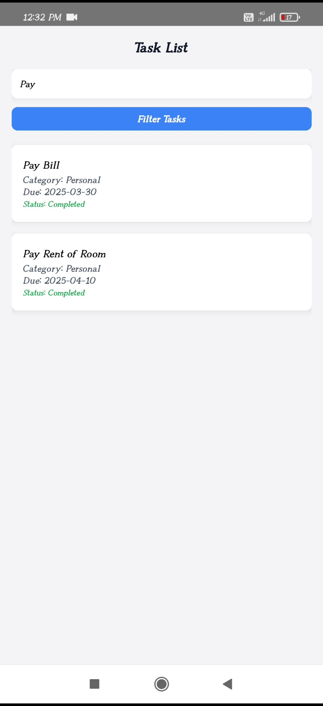;
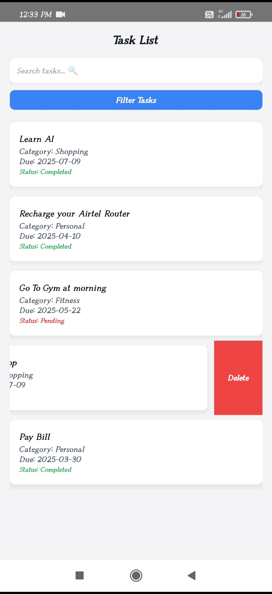;
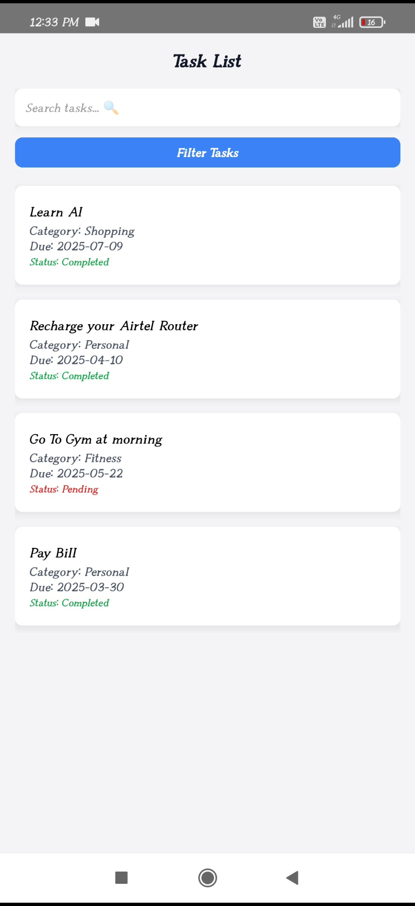;
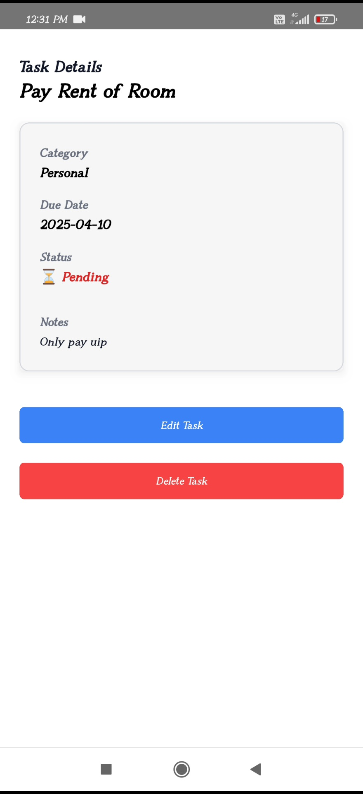;
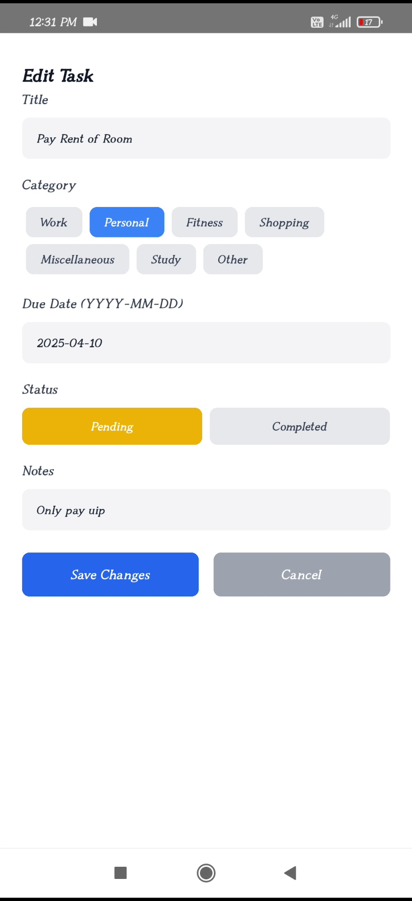;
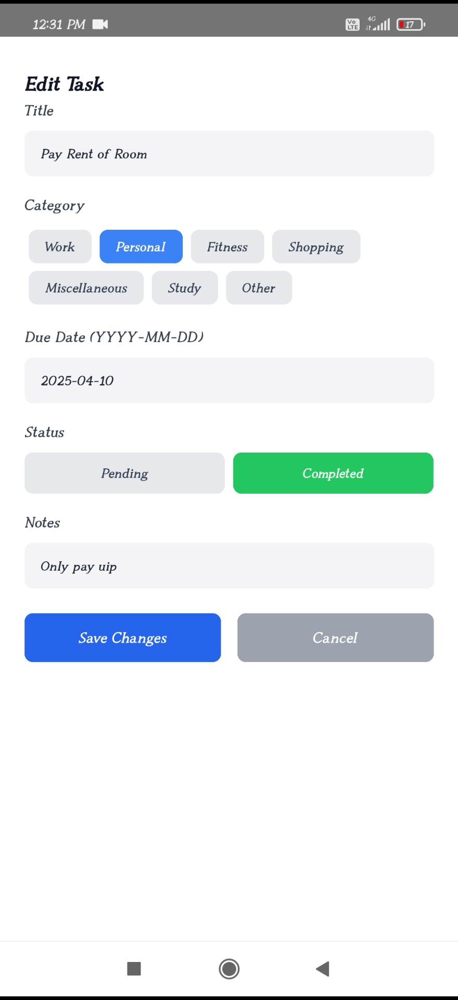;
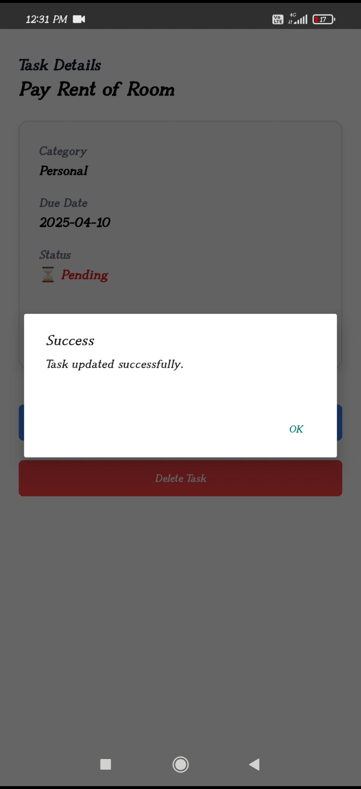;
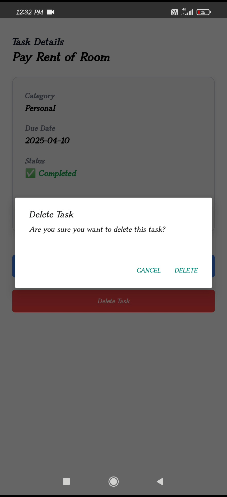;
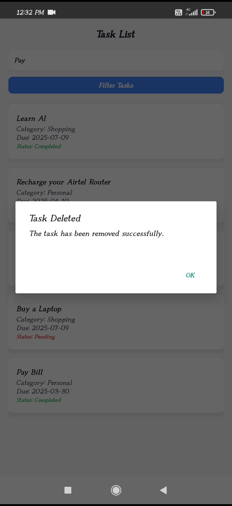;
;
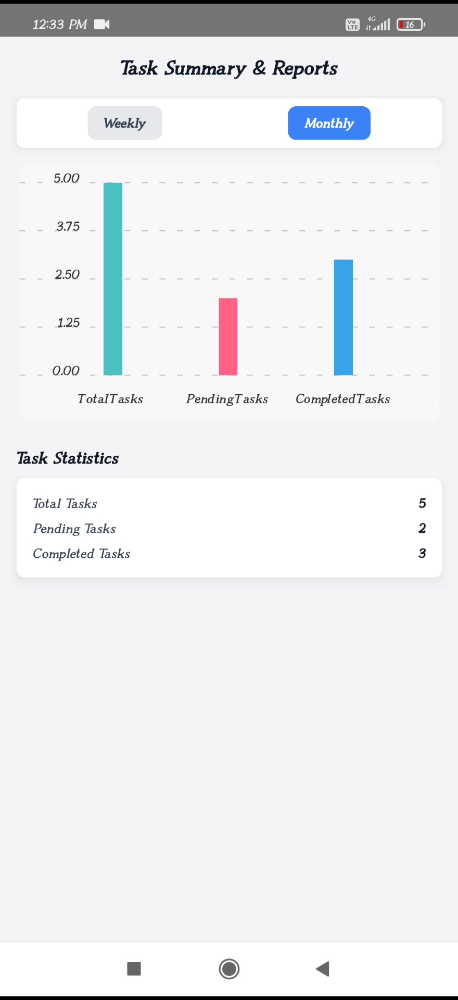;


---

## 🎥 Video Demo

[Watch Demo](https://your-demo-video-link.com)

---

## 📱 APK File

[Download APK](https://your-apk-download-link.com)

---

## ❓ Frequently Asked Questions (FAQ)

### 1️⃣ What is this project about?
This is a Smart To-Do List app that helps users manage tasks efficiently, providing features like task categorization, reminders, and reports.

### 2️⃣ How can I install and run this project?
Follow the **Project Setup Instructions** section above to install dependencies and run the project.

### 3️⃣ What technologies are used?
- **Frontend:** React Native, JavaScript, Tailwind CSS
- **Backend:** Firebase Firestore

### 4️⃣ Can I contribute to this project?
Yes! Feel free to fork the repository, create a new branch, make your changes, and submit a pull request.

### 5️⃣ How do I report a bug or request a feature?
Open an issue on the GitHub repository or contact the project maintainers.

---

